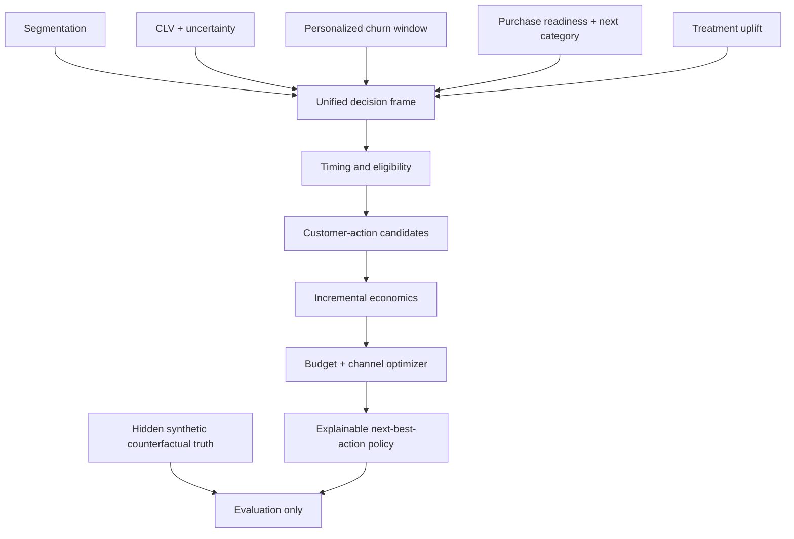

# Customer Next Best Action Engine

[](https://www.python.org/)
[](DATA_PROVENANCE.md)
[](LICENSE)

A reproducible customer decisioning system that combines **customer value, personalized churn timing, purchase readiness, category relevance, treatment uplift, offer economics, and portfolio constraints** to decide who should receive which action now, and who should receive no action.

This repository is the orchestration layer of a broader customer-analytics portfolio. It does not retrain every upstream model inside one monolith. Instead, it creates one clean synthetic customer universe, reproduces compatible score contracts, and solves the final operating decision.

> All customers, scores, offer costs, constraints, counterfactual outcomes, and reported results are synthetic. They validate the workflow under a controlled setup and are not claims about production performance.

## The decision

For each customer at a score date, the engine answers:

1. **When:** Is this an appropriate time to act, review soon, monitor, or suppress contact?
2. **Who:** Is the customer eligible and economically defensible to contact?
3. **What:** Reminder, 5% voucher, 10% voucher, service call, or no action?
4. **Context:** Which category should frame the message or offer?
5. **Portfolio:** Which individually attractive actions still fit the shared budget and channel capacities?

The final decision can explicitly be **no action**. A high churn score, high CLV, or high purchase probability is not enough by itself.

## Why this is an orchestration project

The portfolio already contains separate systems for customer segmentation, CLV, churn timing, next-purchase recommendation, causal treatment uplift, and constrained resource allocation. Those projects answer different statistical questions and use separate synthetic customer universes.

This repository therefore uses **contract reuse rather than synthetic-ID reuse**:



See [Upstream Contracts](docs/UPSTREAM_CONTRACTS.md) for the exact integration boundary.

## Action economics

The engine does not rank offers by conversion probability alone.

For each eligible customer-action pair:

```text
predicted_treated_probability
    = clip(purchase_readiness_30d + predicted_uplift, 0, 1)

gross_incremental_margin
    = predicted_uplift * expected_order_margin

expected_action_cost
    = fixed_action_cost
    + channel_cost
    + predicted_treated_probability * discount_rate * expected_order_value

predicted_incremental_net_value
    = gross_incremental_margin - expected_action_cost
```

The voucher subsidy is charged on all expected treated purchases, including purchases that were likely to happen without the offer. This prevents a common targeting failure: increasing conversion while destroying contribution margin through unnecessary discounting.

CLV is deliberately not added to the short-horizon action score. Its lower-bound estimate is used as an individual `investment_ceiling`, avoiding double counting across different time horizons.

## Portfolio optimization

The final mixed-integer policy maximizes predicted incremental net value subject to:

- at most one active action per customer;
- a shared expected-action-cost budget;
- push, email, and call capacities;
- consent and contact-frequency rules;
- CLV-based customer investment ceilings;
- service-call eligibility and uncertainty guardrails.

No action is always feasible, so the optimizer is never forced to spend budget on a negative-value treatment.

## Reproducible synthetic result

The committed run uses seed `42` and 3,000 synthetic customers. Hidden counterfactual action values are retained only by the evaluator; the deployable policy cannot access them.

| Policy | Customers contacted | Synthetic true incremental net value | Regret vs oracle |
|---|---:|---:|---:|
| Do nothing | 0 | 0.00 | 100.0% |
| Risk-only reminder | 670 | 981.51 | 25.8% |
| Uplift-ranked reminder only | 670 | **1,081.82** | 18.2% |
| Segment rules | 392 | 355.74 | 73.1% |
| **Next Best Action Engine** | **700** | **1,248.04** | **5.6%** |
| Synthetic oracle | 700 | 1,322.06 | 0.0% |

The engine produced **15.4% more synthetic true incremental net value than the strongest non-oracle baseline**, the uplift-ranked reminder-only policy. This result is specific to the synthetic generator and fixed configuration.


### Selected action mix

| Action | Customers |
|---|---:|
| Reminder | 656 |
| Service call | 30 |
| 5% voucher | 13 |
| 10% voucher | 1 |
| No action | 2,300 |

The low voucher count is intentional rather than a reporting defect: under the configured margins, purchase probabilities, and subsidy rules, most discounts do not clear the incremental-value threshold.


### Constraint utilization

| Constraint | Used | Limit |
|---|---:|---:|
| Expected action-cost budget | 249.74 | 250.00 |
| Push capacity | 350 | 350 |
| Email capacity | 320 | 320 |
| Call capacity | 30 | 30 |
| Duplicate active actions per customer | 0 | 0 |

All configured constraints passed in the committed run.

## Explainable customer output

The deployable decision artifact contains one row per customer with fields such as:

```text
customer_id
segment_name
service_tier
churn_probability
purchase_readiness_30d
recommended_category
category_probability
timing_status
recommended_action
channel
predicted_incremental_net_value
expected_action_cost
reason_codes
```

Example reason codes include:

- `high_churn_risk`;
- `purchase_ready`;
- `high_category_confidence`;
- `high_value_tier`;
- `wait_for_better_timing`;
- `contact_frequency_or_consent_guardrail`;
- `no_positive_incremental_value`;
- `positive_candidate_not_selected_under_portfolio_constraints`.

Reason codes describe the policy path; they are not causal explanations of an individual customer's behavior.

## Evaluation boundary

The synthetic generator creates hidden action effects for reminder, voucher, and service-call candidates. These fields are kept in a separate evaluator table and never merged into the deployable decision frame.

A dedicated leakage test changes the hidden counterfactual truth and verifies that the selected deployable policy does not change. The synthetic oracle can see the hidden values only after policy selection and exists to quantify regret.

## Repository structure

```text
configs/                    offer economics, timing rules, budget, and capacities
src/next_best_action/       simulation, contracts, timing, candidates, economics, policy, evaluation
reports/                    reproducible metrics, samples, and figures
docs/                       architecture, contracts, policy, system card, interview guide
tests/                      contract, timing, economics, constraint, leakage, and pipeline tests
scripts/                    public-file sensitive-content scan
data/generated/             reproducible row-level synthetic files, excluded from Git
.github/workflows/           CI for Python 3.11 and 3.12
```

## Reproduce the project

Python 3.11 or later is required.

```bash
git clone https://github.com/parisaMSTFV/customer-next-best-action-engine.git
cd customer-next-best-action-engine
python -m venv .venv
```

Activate the environment and install:

```bash
# macOS / Linux
source .venv/bin/activate

# Windows PowerShell
.venv\Scripts\Activate.ps1

python -m pip install -e ".[dev]"
```

Run the full workflow and checks:

```bash
make run
make check
```

The full synthetic customer tables are regenerated locally. Public Git history contains aggregate reports and a small deployable decision sample, not the evaluator truth table.

## Documentation

- [Analysis Plan](docs/ANALYSIS_PLAN.md)
- [Architecture](docs/ARCHITECTURE.md)
- [Upstream Contracts](docs/UPSTREAM_CONTRACTS.md)
- [Decision Policy](docs/DECISION_POLICY.md)
- [Decision System Card](docs/MODEL_CARD.md)
- [Interview Guide](docs/INTERVIEW_GUIDE.md)
- [Data Provenance](DATA_PROVENANCE.md)
- [Reproducible Run Summary](reports/run_summary.md)
- [Policy Comparison](reports/policy_comparison.csv)
- [Decision Sample](reports/decision_sample.csv)

## Limitations

- All behavior and treatment effects are synthetic.
- The engine reproduces compatible upstream score contracts rather than running the earlier repositories as production services.
- Treatment definitions are assumed stable and customer interference is absent.
- Voucher economics simplify redemption, returns, supplier funding, tax, and long-term incentive habituation.
- Channel selection uses consent and engagement preference rather than a causal channel-treatment model.
- Inventory, live pricing, campaign collisions, and real-time deliverability are not modeled.
- Protected characteristics are deliberately excluded; production fairness assessment would still be required on governed real data.
- A production policy would require persistent randomized holdouts, cost reconciliation, monitoring, and privacy/legal review.

## License

MIT
