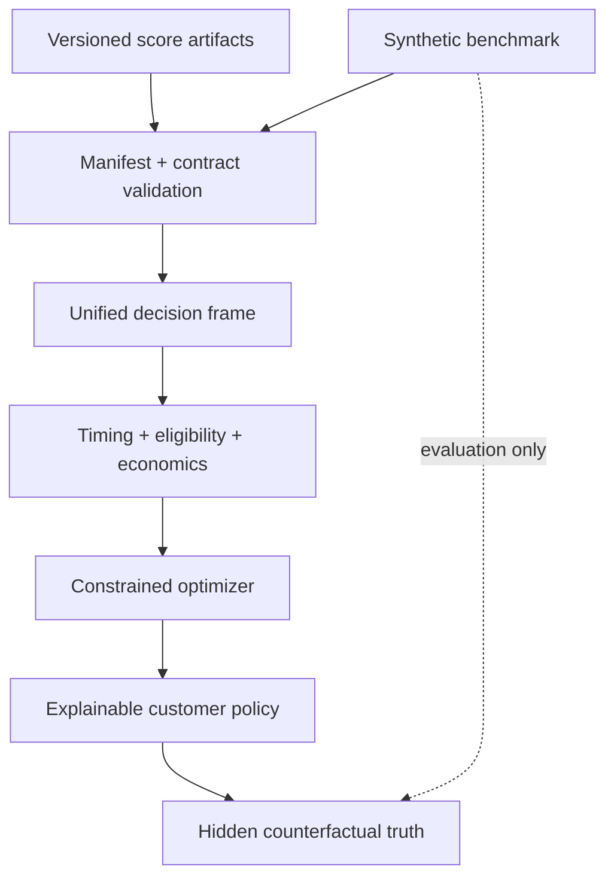

# Architecture

## Module responsibilities

- `simulation.py`: clean-room unified synthetic universe and hidden evaluator truth.
- `inputs.py`: manifest, checksum, path, and external-artifact loading.
- `contracts.py`: schema, value, key, and leakage-boundary validation.
- `timing.py`: contact-frequency and personalized purchase-window routing.
- `candidates.py`: deployable customer-action rows, channel-consent checks, and comparable economics; no evaluator-truth fields are accepted.
- `policy.py`: mixed-integer portfolio optimization and constrained greedy baselines.
- `baselines.py`: non-oracle comparison policies.
- `explain.py`: one-row-per-customer decision output and reason codes.
- `evaluation.py`: post-selection evaluator joins, constrained-oracle value, portfolio constraints, and customer eligibility audits.
- `reporting.py`: reproducible reports and figures.
- `pipeline.py`: end-to-end orchestration.

## Separation of concerns

The engine does not retrain CLV, churn, recommendation, or causal models. Those are upstream analytical responsibilities. External mode consumes their standardized, versioned score exports; benchmark mode generates a unified synthetic universe for counterfactual evaluation. Both paths apply the same operating rules and optimizer.

This separation keeps the capstone from becoming a second copy of every earlier project.
